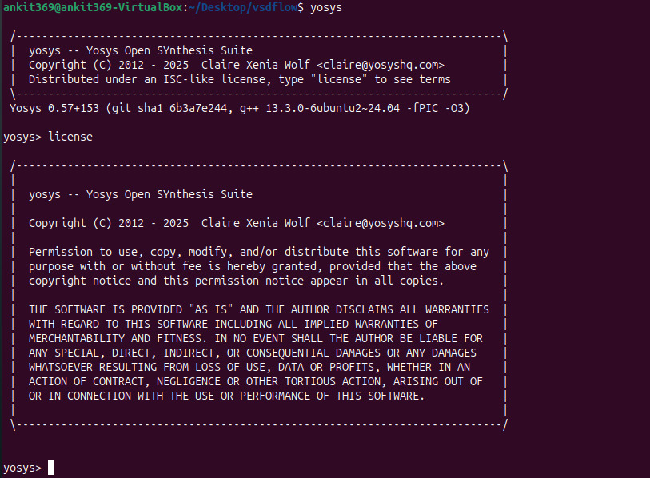
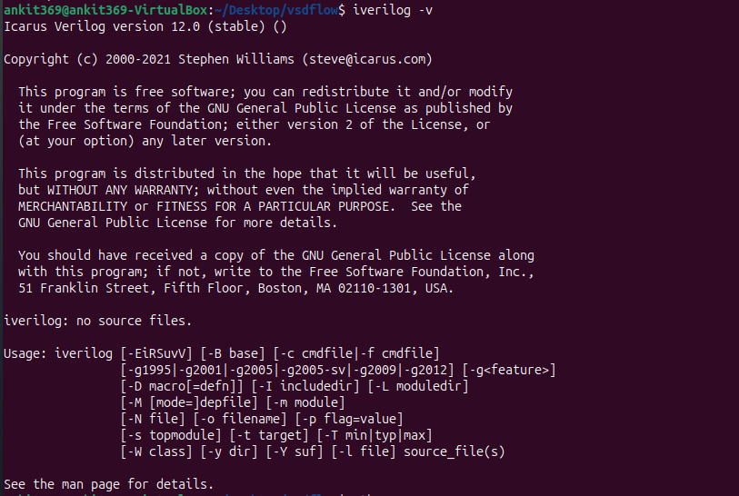
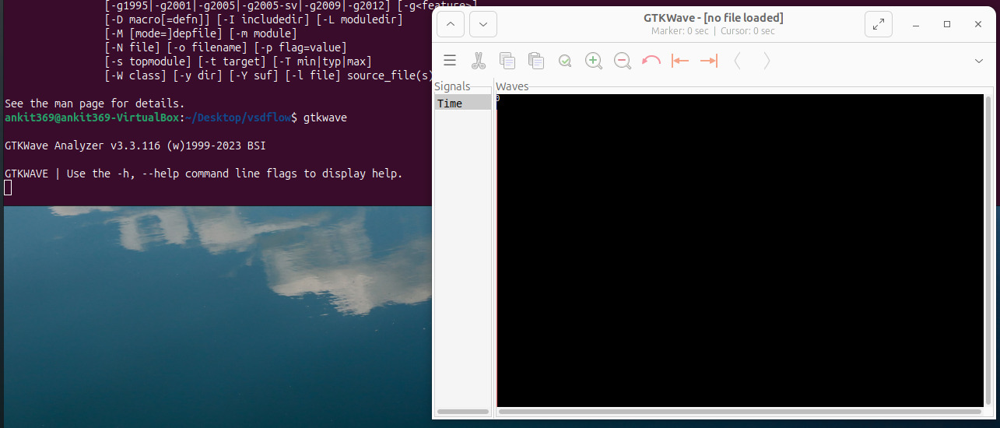

# 🚀 Week 0 — Tool Installation 
---

> *Week 0 objective:* Prepare the dev environment for the India RISC-V Tapeout Program — install the required EDA toolchain on an Ubuntu VM and provide visual proof (terminal screenshots) for each installation.

---

## 🖥 Recommended VM / System config
- *RAM:* 6 GB  
- *Disk:* 50 GB  
- *OS:* Ubuntu 20.04 LTS or newer  
- *vCPU:* 4

If you use VirtualBox, download it here: https://www.virtualbox.org/wiki/Downloads

---

## 🧰 Tools (what & why) — short descriptions

### Yosys — RTL synthesis engine
Yosys is an open-source synthesis tool that converts your SystemVerilog/Verilog RTL into gate-level netlists. It’s a key piece of an open-source ASIC flow (used before P&R / OpenLane).
- Website / repo: https://github.com/YosysHQ/yosys

### Icarus Verilog (iverilog) — simulator
Icarus Verilog is a lightweight open-source Verilog simulator. Use it for quick functional simulation and smoke tests of your RTL and testbenches.
- Install for fast local simulation and VCD generation for GTKWave.

### GTKWave — waveform viewer
GTKWave opens .vcd / .fst waveform files produced by simulations. Use it to inspect signals, debug RTL, and capture waveform screenshots for reports.

### VirtualBox (optional) — host VM platform
Use VirtualBox to run a reproducible Ubuntu VM environment on your host machine if you prefer the sandboxed VM approach.

---

## Installation instructions (commands)

### 1) VirtualBox
Download and install VirtualBox from:
https://www.virtualbox.org/wiki/Downloads

---

### 2) Yosys (build from source)
bash
sudo apt-get update
git clone https://github.com/YosysHQ/yosys.git
cd yosys
# ensure build tools available
sudo apt install -y make
sudo apt-get install -y build-essential clang bison flex \
 libreadline-dev gawk tcl-dev libffi-dev git \
 graphviz xdot pkg-config python3 libboost-system-dev \
 libboost-python-dev libboost-filesystem-dev zlib1g-dev
make config-gcc
make
sudo make install
`

*Verify Yosys installation*

bash
yosys -V

*Proof image (example):*

---

### 3) Icarus Verilog (iverilog)

bash
sudo apt-get update
sudo apt-get install -y iverilog

*Verify Icarus Verilog*

bash
iverilog -v

*Proof image (example):*

---

### 4) GTKWave

bash
sudo apt-get update
sudo apt install -y gtkwave

*Verify GTKWave*

bash
gtkwave --version

*Proof image (example):*

---