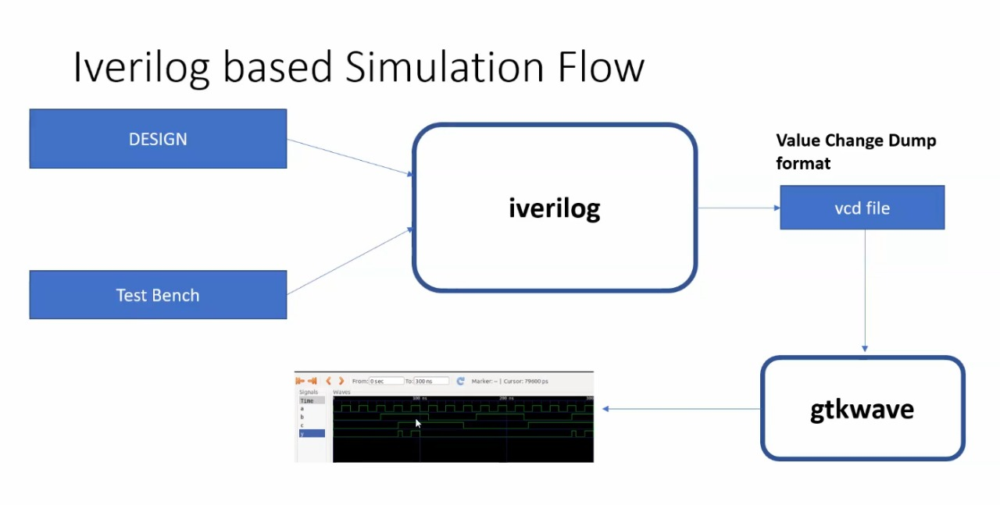
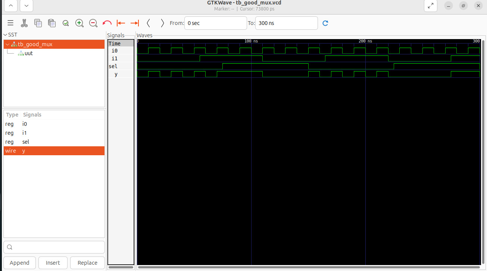
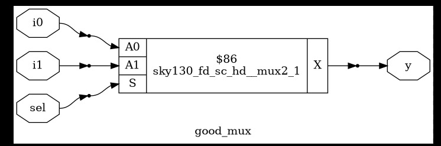

# Day 1 — Introduction to Verilog RTL design and Synthesis

Welcome to **Day 1 of the RTL Design & Synthesis Workshop** (India RISC-V Tapeout Program).
This README serves as a hands-on guide and documentation for setting up, simulating, and analyzing simple Verilog RTL designs using **Icarus Verilog**, **GTKWave**, and **Yosys**.

---
## Getting started — clone the workshop repository

To begin this lab, clone the complete workshop repository that contains every file used in the day-wise exercises (examples, scripts, and reference material). Do **not** treat this repository only as a read-only guide — it is the working repository for today's hands-on tasks.

```bash
git clone https://github.com/kunalg123/sky130RTLDesignAndSynthesisWorkshop.git
cd sky130RTLDesignAndSynthesisWorkshop
```

This repository includes the `day1/` folder (and subsequent day folders) with Verilog sources, testbenches, Yosys scripts, and example waveforms so you can follow along and run the exact commands used in this workshop.

## Day 1 — Short introduction (what you'll learn today)

Day 1 is an introduction to the RTL design and verification flow. You'll learn the fundamentals and run a complete mini-workflow: write a simple Verilog RTL module (a 2:1 multiplexer), create a testbench that drives stimulus, simulate the design with **Icarus Verilog (iverilog)** to generate a VCD waveform, inspect timing and signal transitions using **GTKWave**, and finally perform RTL-to-gate synthesis using **Yosys** with the Sky130 standard-cell library.

Key concepts covered today:

* Verilog RTL basics: modules, ports, `always` blocks, combinational vs sequential logic.
* Testbench patterns: stimulus generation, `$dumpfile` and `$dumpvars` for VCD tracing.
* Simulation flow with `iverilog` and `vvp` — how the simulator reacts to signal changes.
* Waveform analysis with `gtkwave` to visually verify signal behavior.
* Technology mapping and synthesis using `yosys` and a Liberty (`.lib`) file from Sky130 repo.

## Reference figures

Below are the reference figures for Day 1 (waveform screenshots and the simulation flow diagram) — add them to your report or use them while following the steps.







## Overview

This lab guide will walk you through Day 1 tasks: writing a simple Verilog RTL module (2:1 multiplexer), creating a testbench, running behavioral simulation with **Icarus Verilog (iverilog)**, viewing waveforms with **gtkwave**, and performing RTL-to-gates synthesis using **Yosys** with the Sky130 cell library. Follow the steps in order — each section includes runnable commands and troubleshooting tips so you can complete the exercise end-to-end.

## Objectives

By the end of this lab you will be able to:

* USE RTL module (`good_mux.v`) and a corresponding testbench (`tb_good_mux.v`) from sky130 repo.
* Run an iverilog simulation and generate a VCD waveform file.
* Inspect signals using gtkwave to validate functional behavior.
* Run Yosys to synthesize the RTL into a gate-level netlist using the Sky130 liberty file.
* Produce a gate-level Verilog netlist `good_mux_netlist.v`.

---

## Prerequisites

* Ubuntu (or Linux with apt package manager) recommended.
* Tools: `iverilog`, `gtkwave`, `yosys`.

Install (quick) — run with sudo if needed:

```bash
sudo apt-get update
sudo apt-get install -y iverilog gtkwave yosys
```

> If you already have Yosys built from source (or using a container), use that installation instead.

---

## Files in this exercise

Place these files in a folder `day1/`:

```
day1/
├─ good_mux.v        # RTL: 2:1 multiplexer
├─ tb_good_mux.v     # Testbench for good_mux
├─ run_sim.sh        # helper script to run simulation 
├─ run_synth.ys      # optional Yosys script for batch synthesis
└─ Images/           # example diagrams/screenshots 
```

### Example `good_mux.v` (behavioral, readable)

```verilog
module good_mux (
    input  wire i0,
    input  wire i1,
    input  wire sel,
    output reg  y
);

always @(*) begin
    if (sel)
        y = i1;
    else
        y = i0;
end

endmodule
```

### Example `tb_good_mux.v` (testbench)

```verilog
`timescale 1ns / 1ps
module tb_good_mux;
    // Inputs
    reg i0, i1, sel;
    // Outputs
    wire y;

    // Instantiate the Unit Under Test (UUT)
    good_mux uut (
        .sel(sel),
        .i0(i0),
        .i1(i1),
        .y(y)
    );

    initial begin
        $dumpfile("tb_good_mux.vcd");
        $dumpvars(0,tb_good_mux);
        // Initialize Inputs
        sel = 0;
        i0 = 0;
        i1 = 0;
        #300 $finish;
    end

    always #75 sel = ~sel;
    always #10 i0 = ~i0;
    always #55 i1 = ~i1;
endmodule

```

---

## Part A — iverilog simulation (step-by-step)

1. Open a terminal in `day1/`.
2. Compile design and testbench into a simulation executable:

```bash
iverilog good_mux.v tb_good_mux.v
```

3. Run the simulation executable to produce the VCD file:

```
./a.out
```

4. Open the VCD in gtkwave to inspect signals:

```bash
gtkwave tb_good_mux.vcd
```

**Notes / expected behavior**

* The simulator evaluates `always @(*)` whenever inputs change and updates `y` accordingly.
* If the VCD contains no signals, check that you used `$dumpvars(0, tb_good_mux);` and the testbench ran long enough before `$finish`.

---

## Part B — Visual verification (gtkwave)

1. Launch `gtkwave good_mux.vcd`.
2. In GTKWave, add these signals from the signal tree: `/tb_good_mux/i0`, `/tb_good_mux/i1`, `/tb_good_mux/sel`, `/tb_good_mux/dut/y`.
3. Zoom and step through time to confirm `y` follows `i0` or `i1` per `sel`.

**Tip:** Save your GTKWave layout (`File -> Save As`) so you can re-open the waveform layout later.

---

## Part C — Yosys synthesis (RTL → gate netlist)

This section shows an interactive and a batch method.

### Interactive method (step commands inside yosys prompt)

1. Start Yosys:

```bash
yosys
```

2. At the `yosys>` prompt, run:

```
read_liberty -lib ../lib/sky130_fd_sc_hd__tt_025C_1v80.lib
read_verilog good_mux.v
synth -top good_mux
abc -liberty ../lib/sky130_fd_sc_hd__tt_025C_1v80.lib
show
write_verilog -noattr good_mux_netlist.v
```

### Batch method (create `run_synth.ys`)

Create `run_synth.ys`:

```text
read_liberty -lib ../lib/sky130_fd_sc_hd__tt_025C_1v80.lib
read_verilog good_mux.v
synth -top good_mux
abc -liberty ../lib/sky130_fd_sc_hd__tt_025C_1v80.lib
write_verilog -noattr good_mux_netlist.v
```

Run it:

```bash
yosys -s run_synth.ys
```

**What these steps do**

* `read_liberty` — loads timing and cell data for the target technology (Sky130 library here).
* `read_verilog` — ingest your RTL.
* `synth -top` — run the front-end synthesis (technology independent) to produce a netlist.
* `abc -liberty` — maps the netlist to the standard-cell library (technology dependent).
* `write_verilog -noattr` — outputs a cleaned gate-level Verilog netlist.

**Result:** `good_mux_netlist.v` — a gate-level representation mapped to Sky130 cells.

---

## Verification & sanity checks

* Inspect `good_mux_netlist.v` for expected gates (e.g., `and`, `or`, `mux` primitives depending on mapping).
* Re-simulate the netlist (optional) by creating a simple testbench that instantiates the gate-level file and re-running iverilog+vvp to confirm functional equivalence.

---

## Troubleshooting Yosys

* *`read_liberty` fails*: confirm the path `../lib/sky130_fd_sc_hd__tt_025C_1v80.lib` exists relative to your `day1/` folder. Adjust the path if your library is elsewhere.
* *`abc` reports unmapped cells*: ensure the liberty file matches the library used by `abc`.
* *Schematic `show` doesn't appear*: Yosys will try to open a viewer — this requires a DISPLAY (X11). If running headless, skip `show`.
---

## Checklist (Day 1 deliverables)

* [ ] `good_mux.v` created and saved in `day1/`
* [ ] `tb_good_mux.v` created and saves and runs
* [ ] `good_mux.vcd` produced and waveform inspected with gtkwave
* [ ] `good_mux_netlist.v` synthesized with Yosys

---

## Final notes

This lab lays the foundation for RTL flow: write → simulate → verify → synthesize.  
Good luck — enjoy Day 1! 🚀
