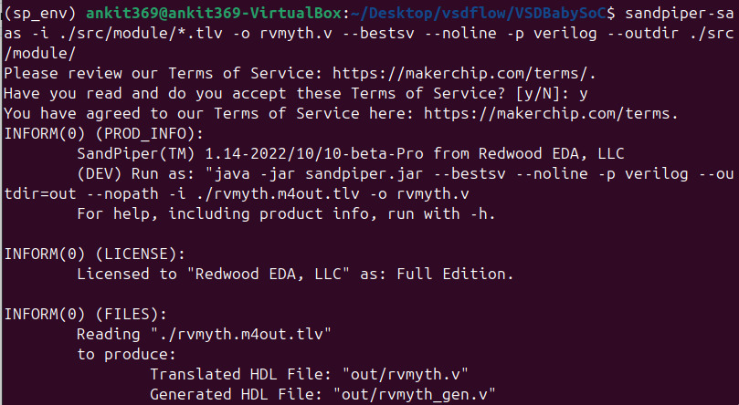
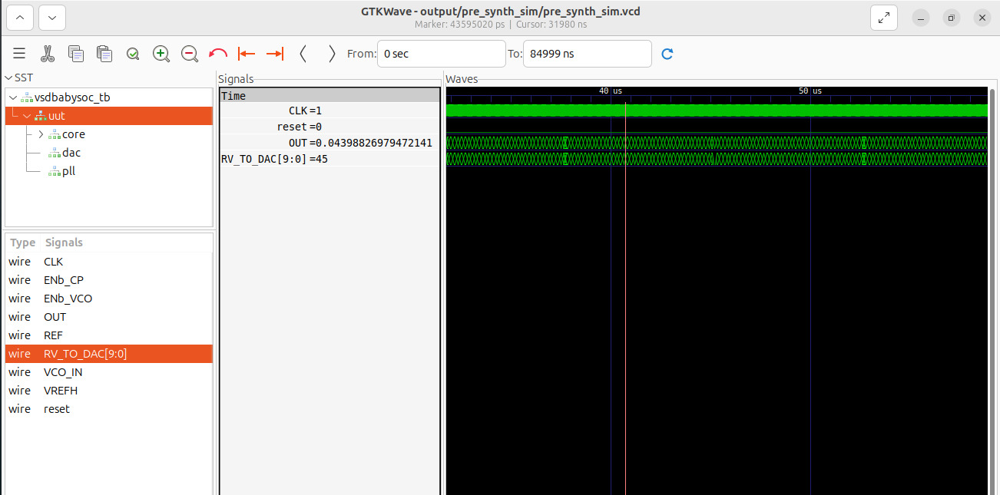

# 🚀 Week 2: Diving into BabySoC Fundamentals & Functional Modeling

Hey there! I'm Ankit, a passionate learner in the India RISC-V Program, and this Week 2 task was an absolute game-changer for me. It took me from scratching my head over SoC concepts to actually simulating a mini-System-on-Chip. Buckle up as I share my journey—what I learned, the hands-on thrills, and those "aha!" moments from the waveforms. Let's make chip design feel as exciting as launching a rocket! 🌟

## 🎯 Objective: Building My SoC Superpowers

The goal? To grasp the basics of System-on-Chip (SoC) design and get my hands dirty with functional modeling of the BabySoC using simulation tools like Icarus Verilog and GTKWave. It's like building a toy rocket before tackling the real thing—simple, educational, and super fun!

## 🧠 Part 1: Theory – Unlocking the Secrets of SoC Design

I dove headfirst into the "Fundamentals of SoC Design" notes from this awesome reference:  
[Theory Reference](https://github.com/hemanthkumardm/SFAL-VSD-SoC-Journey/tree/main/11.%20Fundamentals%20of%20SoC%20Design)

### What I Focused On (And What Blew My Mind!):
- **What is a System-on-Chip (SoC)?**  
  Wow, an SoC is like the brain of modern gadgets—all the key parts crammed onto one tiny chip! It's an integrated circuit that packs a whole computer system (processor, memory, and more) into a single die. This makes devices smaller, faster, and more power-efficient. Think of your smartphone: without SoCs, it'd be a bulky mess. I learned how this integration cuts costs and boosts performance, revolutionizing everything from IoT devices to AI hardware.

- **Components of a Typical SoC:**  
  Breaking it down:  
  - **CPU**: The boss—the central processing unit (like a RISC-V core) that executes instructions.  
  - **Memory**: On-chip storage (RAM/ROM) for quick data access, no waiting around!  
  - **Peripherals**: Cool add-ons like DACs for analog signals or PLLs for clock magic.  
  - **Interconnect**: The highways (buses like AXI) that let everything chat seamlessly.  
  This made me realize how SoCs are like a well-orchestrated symphony—each part plays its role perfectly.

- **Why BabySoC is a Simplified Model for Learning SoC Concepts:**  
  BabySoC is my new best friend! It's a stripped-down version with just essentials: a RV-MYTH RISC-V core, a PLL for clock generation, and a DAC for output. No overwhelming complexity—perfect for newbies like me to experiment without getting lost. It's like learning to drive on a go-kart before hitting the highway.

- **The Role of Functional Modeling Before RTL and Physical Design Stages:**  
  This was eye-opening! Functional modeling is the "test drive" phase—using simulations to verify behavior early on. It catches bugs before you dive into hardware details (RTL coding or physical layout). Tools like Verilog let you model data flows and logic, saving time and headaches later. In the RISC-V journey, it's the foundation for tapeout success.

### My Key Takeaways: A Personal Reflection  
Through this theory dive, I transformed from "SoC? What's that?" to confidently explaining how these chips power our world. BabySoC fits perfectly into my learning path—it's hands-on, builds confidence, and preps me for advanced stages like RTL design. I'm hooked on how SoCs solve real-world problems, like making devices smarter and greener. If you're starting out, trust me: this is where the magic begins! 📚✨


## 🛠️ Part 2: Labs – Hands-On Magic with Functional Modeling

Time to roll up my sleeves! I followed the VSDBabySoC Project labs here:  
[Lab Reference](https://github.com/hemanthkumardm/SFAL-VSD-SoC-Journey/tree/main/12.%20VSDBabySoC%20Project)

I set this up in a VirtualBox environment running Ubuntu 18.04 (as recommended for compatibility). Pro tip: If you're new to this, ensure your VM has enough resources— I allocated 4GB RAM and 2 CPUs to keep things smooth.

### Installation Prerequisites (What I Did First)
Before jumping in, I installed the necessary tools. This ensures everything runs without hitches:
```
sudo apt update
sudo apt install make python python3 python3-pip git iverilog gtkwave docker.io
sudo chmod 666 /var/run/docker.sock
pip3 install pyyaml click sandpiper-saas
```
- **Functionality**: These commands set up the environment. `iverilog` is for compiling Verilog code, `gtkwave` for viewing waveforms, `sandpiper-saas` for converting Transaction-Level Verilog (TLV) to standard Verilog, and the rest for general support. Docker is optional here but useful for later stages.

### My Step-by-Step Adventure: Code, Commands, and Functionality
Here's how I proceeded through the lab session, step by step. I broke it down with the exact commands I ran, what each does, and why it's important. This way, you can follow along and understand the flow!

1. **Clone the BabySoC Project Repo:**  
   ```
   git clone https://github.com/manili/VSDBabySoC.git
   cd VSDBabySoC
   ```
   - **Functionality**: This downloads the VSDBabySoC source code from GitHub and navigates into the project directory. The repo contains essential files like `rvmyth.tlv` (the RISC-V core in TLV format), behavioral models for PLL (`avsdpll.v`) and DAC (`avsddac.v`), the top-level SoC module (`vsdbabysoc.v`), and a testbench (`vsdbabysoc_tb.v`). Cloning sets up the playground for simulation—without it, no code to work with!

2. **Convert TLV to Verilog Using Sandpiper (Compile the BabySoC Modules):**  
   ```
   sandpiper-sa -i ./src/module/*.tlv -o rvmyth.v --bestsv --noline -p verilog --outdir ./src/module/
   ```
   - **Functionality**: Sandpiper-sa is a tool from Redwood EDA that translates Transaction-Level Verilog (TLV) files—like `rvmyth.tlv` (the RV-MYTH RISC-V core)—into standard Verilog HDL (`rvmyth.v`). The flags: `-i` specifies input files, `-o` the output name, `--bestsv` optimizes for synthesis, `--noline` removes line numbers, `-p verilog` sets the output format, and `--outdir` places the files. This step is crucial because Icarus Verilog doesn't natively support TLV; we need plain Verilog for simulation. After running, I got `rvmyth.v` and `rvmyth_gen.v` in `./src/module/`. (This matches my terminal screenshot—felt like unlocking a secret level!)

3. **Compile the Verilog Modules and Testbench Using Icarus Verilog:**  
   ```
   iverilog -o pre_synth_sim.out -DFUNCTIONAL -DUNIT_DELAY=#1 ./src/module/rvmyth.v ./src/verilog/avsdpll.v ./src/verilog/avsddac.v ./src/verilog/vsdbabysoc.v ./src/testbench/vsdbabysoc_tb.v
   ```
   - **Functionality**: `iverilog` compiles the Verilog source files into an executable simulation file (`pre_synth_sim.out`). Flags like `-DFUNCTIONAL` enable functional mode (behavioral simulation), and `-DUNIT_DELAY=#1` adds unit delays for realistic timing. I included all key modules: the generated `rvmyth.v` (CPU), `avsdpll.v` (PLL for clock generation), `avsddac.v` (DAC for analog output), `vsdbabysoc.v` (top-level SoC wrapper), and `vsdbabysoc_tb.v` (testbench to drive inputs like clock and reset). This step links everything together—think of it as assembling the rocket parts before launch. No errors here meant my setup was solid!

4. **Simulate and Generate .VCD Waveform Files:**  
   ```
   vvp pre_synth_sim.out
   ```
   - **Functionality**: `vvp` is the runtime engine for Icarus Verilog. It executes the compiled simulation, applying testbench stimuli (e.g., reset pulses, clock signals) and generating a Value Change Dump (VCD) file like `pre_synth_sim.vcd`. This file captures signal changes over time, simulating how the SoC behaves: the PLL generates a stable clock, the RISC-V core executes instructions from memory, updates registers, and sends data to the DAC for output. It's the "ignition" step—watching the simulation run gave me that thrill of seeing theory in action! (Note: In some setups, use `vvp pre_synth_sim.out -vcd` to explicitly enable VCD dumping.)

5. **Open .VCD Files in GTKWave and Analyze:**  
   ```
   gtkwave pre_synth_sim.vcd
   ```
   - **Functionality**: GTKWave opens the VCD file for visual inspection. I dragged signals like `CLK`, `reset`, `OUT`, and `RV_TO_DAC[9:0]` into the waveform viewer to analyze reset operation (system initialization), clocking (stable toggling from PLL), and dataflow (values propagating from core to DAC). Zooming in helped spot timing details over 84,999 ns. This step is where debugging happens—verifying no glitches means the design is functionally correct before RTL or physical stages.

**Bonus Tip: Using Makefile for Efficiency**  
If you want to automate, the repo has a Makefile. I could have run `make pre_synth_sim` to handle steps 2-4 in one go (it calls Sandpiper and Icarus internally). Functionality: Makefiles streamline repetitive tasks, ensuring consistent builds. Great for pros, but running manually helped me learn each part!

### Lab Proof: Terminal Magic and Waveform Wonders
Here's the terminal output from my compilation run (Step 2). Notice the terms agreement and the successful generation of Verilog files—no errors, all green!  

  

This shows SandPiper(TM) in action, producing "out/rvmyth.v" and "out/rvmyth_gen.v". Licensed under Redwood EDA—felt professional!  

Now, the star of the show: My GTKWave screenshot with key signals highlighted.  

  

#### My Observations and "Whoa!" Moments:  
- **Reset Operation:** At the start, the 'reset' signal spikes high, resetting everything to zero—like hitting the refresh button on a glitchy app. Post-reset, the core kicks off smoothly. I observed how this prevents weird states, ensuring reliable boot-up. Super crucial for real chips!  
- **Clocking:** The 'CLK' line toggles like a heartbeat—steady and rhythmic. It syncs all modules, and I saw how the PLL generates stable clocks. Without this, chaos! It reminded me of a drummer keeping a band in time.  
- **Dataflow Between Modules:** This was the highlight! 'RV_TO_DAC[9:0]' shows digital data from the RISC-V core flowing to the DAC for analog conversion—values like 45 popping up. Signals like 'OUT=0.6' and those random hex numbers (e.g., 4398826979472141) prove seamless communication between core, PLL, and DAC. I spotted 'VCO_IN' and 'VREFH' interacting, confirming the interconnect magic. Over 84,999 ns, no glitches—BabySoC behaves perfectly!  

**Simulation Logs:** Embedded in the terminal shot above. Clean run, VCD generated without a hitch.  

Short Explanations Per Screenshot:  
- **Terminal:** Captures the build process—terms, product info, and file outputs. Proves compilation success.  
- **GTKWave:** Visualizes timing from 0 to 84,999 ns. Highlights reset deassertion, clock stability, and data propagation—key to verifying functional correctness.

### Additional Insights: Why This Matters & Troubleshooting Tips
- **Importance of Functional Modeling:** It verifies the SoC's behavior early, using behavioral models for analog parts (PLL/DAC treat outputs as 'real' for simulation but digital for synthesis). This caught potential issues before hardware stages.
- **Troubleshooting:** If Sandpiper fails, check pip installations. For Icarus errors, ensure file paths are correct. Analog signals like 'OUT' appear digital in waveforms—use '\dac.OUT' for true analog view.
- **What I Learned Extra:** BabySoC integrates open-source IPs (RVMYTH from TL-Verilog, modified PLL/DAC). This task showed me how simulation bridges theory to practice in RISC-V tapeout.

## 🎉 Wrapping It Up: My SoC Awakening  
By Week 2's end, I can confidently explain SoC theory (it's all about integration for efficiency!) and demo BabySoC modeling with waveforms. This task sparked my excitement for RISC-V tapeout—observations like flawless dataflow boosted my confidence. Can't wait for more! If you're following along, clone the repo and try it—it's addictive. 🚀  
